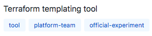

# 2. Github repository topics

|          | 002          |
| :------- | :----------- |
|__Date__  | 2018-08-30   |
|__Status__| Accepted     |

## Context

It is currently unclear within Github repositories what the state and type of the repository is. Although this is often explained within README files, it can be unclear at a glance if something is a service, tool, experimental, or which team it belongs to.

## Decision

To clarify the state of repositories that are within Github, here are some topics to use which will allow others to see the type, state, and ownership at a glance.

Here is an example from the [terraplate](http://github.com/ConnectedVentures/terraplate) project:

> 

### Type
* `service` - A project that runs a single or multiple services within the Fresh8 stack, e.g. ConnectedVentures/f8-watson, ConnectedVentures/f8-console.
* `package` - A project that is utilised by other projects, through package managers such as NPM and dep, e.g.
* `tool` - Project used independently to perform specific tasks, e.g. ConnectedVentures/terraplate, ConnectedVentures/tmp-terra-importer
* `content` - Files used for providing content to services or direct to consumers via CDNs, e.g. ConnectedVentures/f8-assets
* `governance` - Documentation around governance within Fresh8, e.g. fresh8/microservice-principles

### State
* `official-experiment` - Company accepted prototyping and experimentation project, e.g. fresh8/microservice-principles
* `personal-experiment` - Personal prototyping and experimentation project, not yet accepted by Fresh8 as an official experiment, e.g. ConnectedVentures/tmp-terra-importer

### Ownership
* `cms-team`
* `ads-team`
* `dmp-team`
* `platform-team`

### Synonyms
If the project is referred to by multiple names, such as ConnectedVentures/f8-garrulous (aka localisation), these should also be included in the topics.

## Consequences

All Github users with access will be able to see, at a glance from the organisation index and repository pages, the type, state, ownership, and any synonyms associated with the repository.
